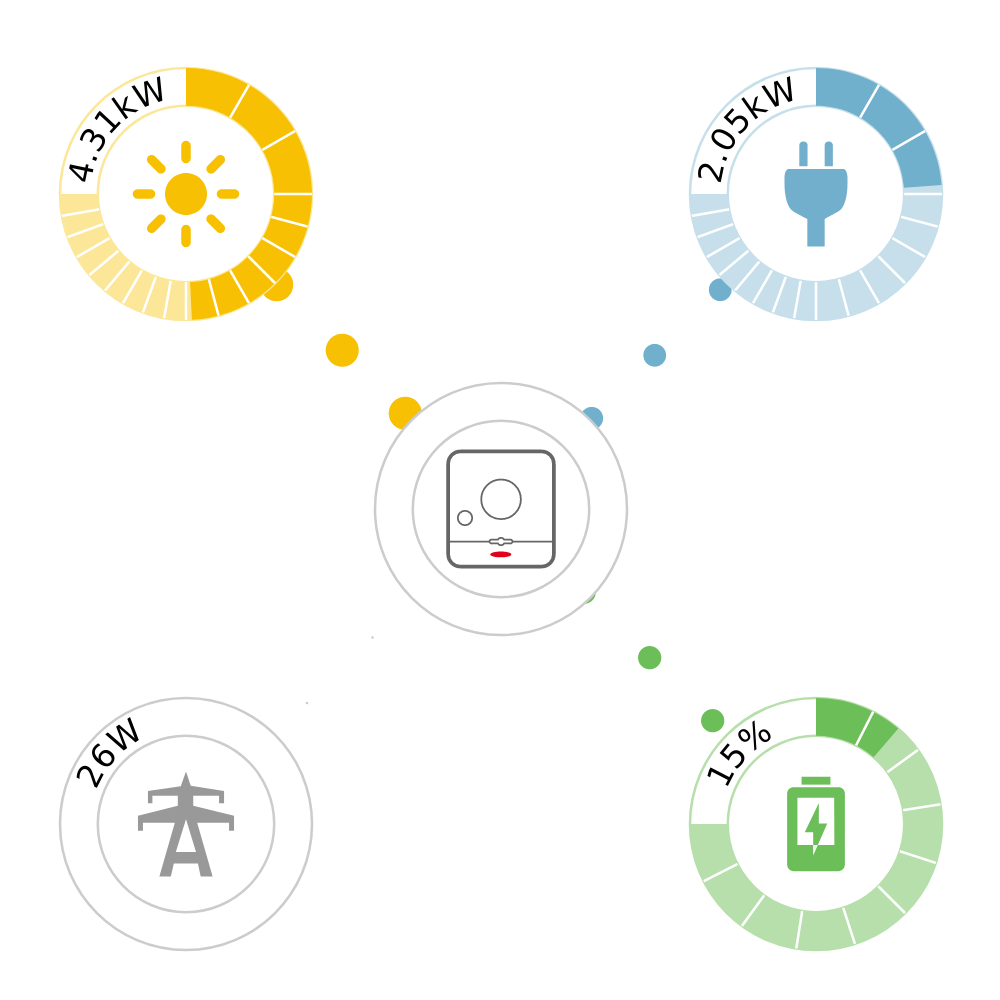

# FroniusFlow

This repo creates a slim website with a svg that visualizes the current power flow, using the local Fronius Solar API



## Requirements
 - Fronius inverter with Solar API v1 locally available

## How to use
 - Clone this repo to a location with access to the local Fronius Solar API
 - Adjust the kWp of your site in `web/froniusFlow.js` by changing the `pv_kwp` constant
 - Change the IP of the Fronius Inverter in the `nginx.conf` to your local inverter IP
 - Adjust the port in `docker-compose.yml` from `8125` to what ever port you want to use
 - Start the system with the command `docker-compose up -d`
 - use it standalone or include it into what ever system you want
 
## Translations
In `web/froniusFlow.js` you can change the few language specific strings according to your local language:

### English
```
const lang = {
 battery_charge_w: 'Battery is charged with {0} W!',
 battery_charge_kw: 'Battery is charged with {0} kW!',
 battery_discharge_w: 'Battery is discharged with {0} W!',
 battery_discharge_kw: 'Battery is discharged with {0} kW!'
};
```
